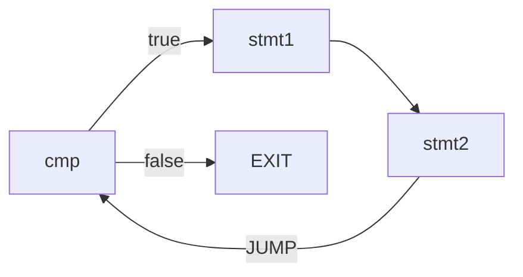
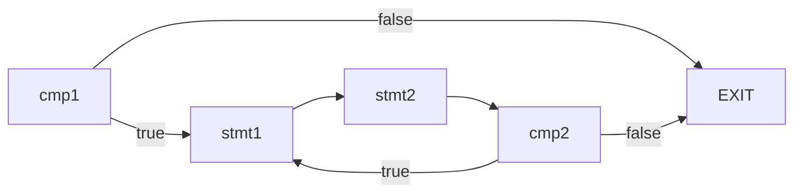

# 代码优化

## 竞速排名要求

竞速排名根据程序运行后的统计信息，加权计算后排名。按照 `ALU` 权重 1， `Jump/Branch` 权重 2， `Memory` 权重 2， `Others` 权重 1 的比例计算后，得到 `FinalCycle = ALU * 1 + Jump * 2 + Branch * 2 + Memory * 2 + Other * 1` 进行排名。在运行正确的前提下， `FinalCycle` 越小排名越靠前。

## 优化策略

### 循环优化

注：该优化方法来自于其他同学在讨论区的分享。

以while循环为例，假设循环次数为N。

优化前，每次执行循环体语句之前判断是否满足条件，执行完循环体再跳回条件判断。

不考虑循环体语句，执行循环的分支语句为N，跳转语句为N





优化后，循环开头先判断一次条件，不满足则跳转到循环结束。循环内语句执行完毕后，判断是否满足循环条件，如果满足则跳转到循环体第1条语句，否则跳转到循环结束。

不考虑循环体语句，执行循环的分支语句为N+1，跳转语句为0。优化后，执行循环的代价降低。




### 基本块划分

笔者采用以下划分基本块的标志：

- 语句序列开头
- 紧跟跳转、分支指令之后的指令
- 由跳转、分支转移到的第一条指令
- 紧跟函数调用之后的指令

将函数调用也作为划分标志的原因：

后面分配临时寄存器，分配到临时寄存器的临时变量不用保存到内存。

但是，这样做会产生跨基本块的临时变量。对于这些变量，不分配寄存器。

### 局部公共子表达式消除

由于从DAG图导出代码，书上的启发式算法只考虑了表达式，没有对IO指令、数组访问、函数调用、传参等特殊情况给出实现建议。
存在多个中间节点时，按照启发式算法可以任意选择中间节点，但是不能保证导出的代码仍然遵循原来的顺序，导致IO指令、数组访问、函数调用、传参等特殊情况出错。

因此，笔者不使用DAG算法。从全局公共子表达式消除算法受到启发，笔者采用以下方法消除局部公共子表达式:

给定基本块内四元式：$s:t \leftarrow x \oplus y$，寻找满足以下条件的四元式 $n:v \leftarrow x \oplus y$ : 从n到s的路径上，既没有计算 $x \oplus y$, 也没有对v,x,y定值。

如果找到这样的四元式 $n:v \leftarrow x \oplus y$ ，那么将 $s:t \leftarrow x \oplus y$ 替换为 $s:t \leftarrow v$

### 算术优化

对于算术运算，判断两边是否都为常数，如果为常数，则生成li伪指令。

对于加法，判断其中一边是否为常数，如果为常数，使用addi指令（或伪指令）。

对于乘法、除法，如果运算数包含2的整数次幂，则使用移位指令(sll, sra)代替，可以减少一条指令。

对于形如`x-x/y*y`的代码，生成汇编时用以下指令进行替代。
假设x,y的值分别保存在t1,t2

```
div $t1, $t2
mfhi $t0
```

另外，通过阅读mars源代码，笔者发现对于 `div t1,t2,t3` 这样的除法伪指令，
mars会生成以下代码，先判断被除数是否为0再进行除法
```asm
bne $t3, $0, LABEL
break
LABEL:
div $t2, $t3
mflo $t1
```

### 常量合并

在一个基本块内，对于运算数只有常量的表达式，且结果为临时变量，其中间代码序列替换为赋值。

这里笔者只对结果为临时变量的四元式进行合并，由于在临时变量只会被定值1次，只在生成表达式的时候出现，变量值不会被后面的代码覆盖。对于跨基本块的临时变量，不进行常量合并。

由于基本块的语句序列是顺序的，采用一遍扫描，从前往后依次进行合并。

例如，有以下四元式序列，计算1+2+3+4

```c
t1 = 1 + 2
t2 = t1 + 3
t3 = t2 + 4
a = t3
```

从前往后，依次将t1,t2,t3替换为3,6,10，最终得到a=10

### 内联

对于只对传入参数进行计算并返回计算结果的函数，没有必要生成函数调用，而是直接内联到调用者的代码，这样可以去掉保存现场、分配栈和跳转等指令。

为了简单起见，只对满足所有以下条件的函数进行内联：

- 不包含函数调用、局部变量等涉及到栈的语句
- 不包含除返回之外的跳转、分支，即不包含标签
- 最多1条返回指令，且位于函数结尾
- 不是main函数

这样，可以直接替换参数后，直接嵌入到对应的函数调用。

### 活跃变量分析

笔者的活跃变量分析分为两个层次：基本块和语句。

寄存器分配只需要基本块的数据流信息，就可以构建冲突图。

采用以下方法进行死代码删除：

若有一条四元式 $s: a \leftarrow b \oplus c$ ，且a不在s的出口活跃集合中，则删除四元式s。

对于每个基本块，运行以下算法：

- 分析每条四元式的活跃变量
- 寻找满足条件的四元式$s: a \leftarrow b \oplus c$，a不在s的出口活跃集合中
- 删除四元式s
- 重复以上过程，直到找不到满足条件的四元式为止。

这里需要每条四元式的数据流分析，可以采用以下方法加速：

先定位到四元式对应的基本块，将计算好的基本块出口活跃集合（记为out集合）作为基本块最后一条四元式的out集合，然后计算每条四元式的数据流信息。由于基本块内语句是顺序执行，只需从后往前迭代一遍。

保守起见，对于数组访问、I/O指令和具有副作用的四元式，不进行删除。

### 合并比较-分支指令

对于先进行比较，紧接着判断结果是否为0并分支的代码序列，使用相应的分支指令替换。

例如：先比较是否相等，得到结果0或1，再使用BEQZ伪指令，可以替换为只使用BEQ一条伪指令。

### 其他优化

合并冗余的赋值，例如：

```
t1 = RET
a = t1
```

这里的两条赋值可以直接合并为 `a=RET`。

重复进行以上过程，直到中间代码序列不再变化。
